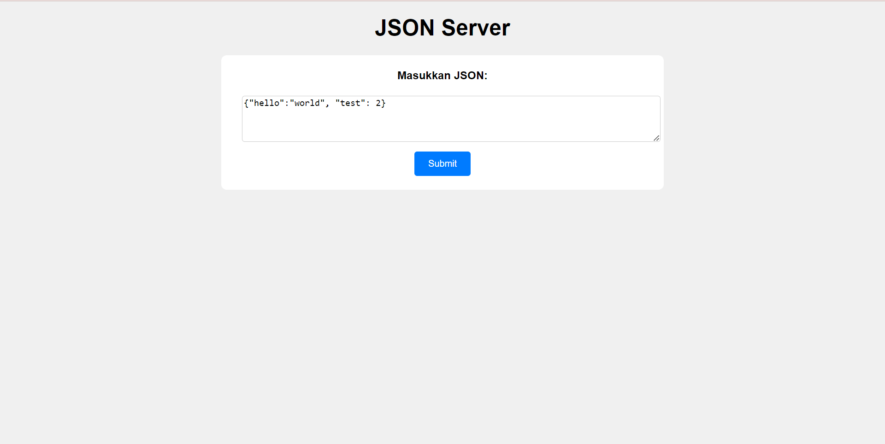

# JSON-SERVER

### `Demo Image`


## `Apa Itu Json Server?`
Ini adalah alat yang sangat berguna untuk pengembangan frontend dan pengujian karena memungkinkan Anda untuk memiliki endpoint API palsu dengan cepat tanpa harus membuat backend yang sebenarnya

## Run With Docker
```bash
docker compose up -d
```
`Note`:Jangan lupa edit koneksi mu di .env

<h4>Dan buka <p>http://localhost:8888</p> and have fun</h4>